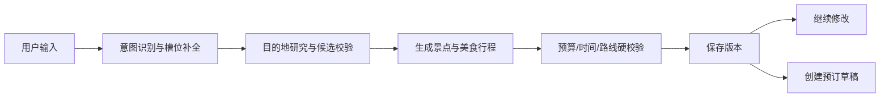

# 一键游（OneClick Trip）

一键游是一个面向旅行规划场景的多端项目：用户可以通过 AI 对话补全目的地、天数、人数、预算和偏好，生成可保存、修改的逐日行程，并管理预订草稿；管理员可以查看用户、行程、预订、Agent 运行记录和知识库管道。

## 当前能力

- 微信小程序：登录、首页推荐、AI 对话、行程列表与详情、预订清单、个人中心。
- 用户 Web 端：城市与模板浏览、AI 助手、Markdown 对话展示、个人资料与行程管理。
- 管理后台：城市、景点、美食、酒店、模板、用户、会话、Agent 运行日志、知识库和预订管理。
- Java 业务后端：Spring Boot、JWT、MyBatis-Plus、MySQL、行程和预订 API、AI 服务桥接。
- Python AI 服务：FastAPI、LangGraph、DeepSeek 结构化输出、Redis Checkpoint、MySQL 方案恢复。
- 旅行规划：意图识别、槽位追问、两阶段研究、预算校验、行程生成、自动评审与修订。
- 美食规划：每天显式安排午餐和晚餐，并根据当天景点区域、人数和预算给出建议。
- 外部工具：Open-Meteo 天气、Nominatim 坐标、OSRM 路线；非实时信息会明确标记为 AI 估算。

> 当前预订流程是安全的业务草稿与确认演示，不会产生真实支付或供应商订单。酒店、交通、门票价格和库存接入真实供应商前均不可视为实时报价。

## 项目结构

```text
oneclick-trip/
├─ backend/             Spring Boot 业务后端（8080）
├─ ai/travel_agent/     FastAPI + LangGraph AI 服务（8000）
├─ frontend/            Vue 3 用户端（5173）
├─ frontend-admin/      Vue 3 管理后台（5174）
├─ miniprogram/         原生微信小程序
├─ docs/                架构、接口和阶段报告
├─ tools/               本地启动与验收脚本
└─ docker-compose.yml   MySQL、Redis、Chroma
```

初次阅读建议从 [项目结构说明](docs/project-structure.md) 开始。AI 业务细节见 [Travel Agent README](ai/travel_agent/README.md)，小程序配置见 [小程序 README](miniprogram/README.md)。

## 核心流程



## 本地运行

### 环境要求

- JDK 17
- Maven 3.9+
- Node.js 20+
- Python 3.11–3.14（推荐 3.12）
- MySQL 8、Redis 7；知识库功能需要 Chroma

先复制根目录和组件中的 `.env.example`，只在本地填写密钥。不要提交 `.env`、真实密码或 API Key。

### 1. 启动基础设施

```bash
docker compose up -d
```

默认端口：MySQL `3306`、Redis `6379`、Chroma `8001`。

### 2. 启动 AI 服务

```powershell
cd ai/travel_agent
python -m venv .venv
.\.venv\Scripts\python.exe -m pip install -e ".[dev]"
.\.venv\Scripts\python.exe -m uvicorn app.main:app --host 127.0.0.1 --port 8000 --reload
```

健康检查：`http://127.0.0.1:8000/health`

接口文档：`http://127.0.0.1:8000/docs`

### 3. 启动 Java 后端

```powershell
cd backend
mvn spring-boot:run
```

接口地址：`http://127.0.0.1:8080`

### 4. 启动两个 Web 前端

```powershell
cd frontend
npm install
npm run dev
```

```powershell
cd frontend-admin
npm install
npm run dev
```

用户端：`http://127.0.0.1:5173`

管理后台：`http://127.0.0.1:5174`

本项目也提供 Windows 一键启动脚本：

```powershell
.\tools\start-oneclick-trip.ps1
```

### 5. 打开微信小程序

使用微信开发者工具导入 `miniprogram/`。模拟器默认访问 `http://127.0.0.1:8080`；真机调试时，需要在 `miniprogram/utils/config.js` 中换成电脑局域网 IP，发布时必须使用已备案的 HTTPS 域名。

## 测试与构建

```powershell
# Python Agent
cd ai/travel_agent
.\.venv\Scripts\python.exe -m pytest -q

# Java 后端
cd backend
mvn test

# 用户端和管理后台
cd frontend
npm run build
cd ../frontend-admin
npm run build
```

GitHub Actions 会在推送和 Pull Request 时自动执行上述检查，并额外检查小程序 JavaScript 语法。

## 主要接口

```text
POST /api/auth/login
GET  /api/cities
GET  /api/trip-plans
POST /api/trip-plans/generate
POST /api/ai/chat/async
GET  /api/ai/jobs/{runId}
GET  /api/ai/conversations
GET  /api/bookings
POST /api/bookings
GET  /api/admin/bookings
GET  /api/admin/agent-runs
POST /api/admin/knowledge/batches/{batchId}/publish
```

更多调用样例见 [docs/api.http](docs/api.http)。

## 协作约定

1. 从最新 `main` 创建功能分支。
2. 不提交 `.env`、IDE 私有配置、运行日志、数据库文件和构建产物。
3. 提交前运行受影响组件的测试或构建。
4. 推送功能分支并创建 Pull Request，等待 CI 通过后再合并。

```bash
git switch main
git pull --ff-only
git switch -c feature/your-feature
git add -A
git commit -m "feat: 描述本次修改"
git push -u origin feature/your-feature
```
