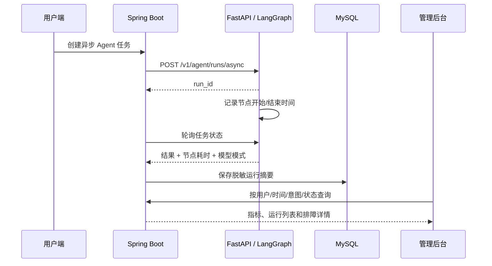

# B-04 管理后台与 Agent 可观测性

## 目标

B-04 用于回答三个问题：某个用户执行了什么意图、Agent 卡在哪个节点、失败或降级由哪个工具造成。它不是模型思维链展示，也不是原始请求抓包。

## 数据链路



## 保存内容

- 用户、会话 ID、运行 ID、意图、状态和总耗时
- LangGraph 节点耗时汇总
- 允许调用的工具名称
- 工具错误码、重试次数和是否可重试
- 模型模式、下一动作、方案是否保存
- Mock、fallback、unavailable、rules fallback 等降级状态

## 不保存内容

- API Key、JWT、confirmation token、hash、幂等密钥
- 完整 HTTP 请求体和第三方供应商响应
- LangChain/LangGraph 内部提示词
- 模型思维链或隐式推理过程

错误消息写入前会截断并脱敏常见 Key、Bearer Token 和 confirmation token。

## 管理端能力

入口：`管理后台 -> Agent 运行`

- 指标：累计运行、完成率、平均耗时、工具异常率、降级运行率
- 筛选：用户/会话/运行 ID、时间范围、意图、状态
- 排障：节点耗时、工具错误、降级来源、错误码
- 会话详情：同时展示消息记录、当前方案和历史方案版本

接口：

```text
GET /api/admin/agent-runs
GET /api/admin/agent-runs/stats
GET /api/admin/agent-runs/{id}
GET /api/admin/conversations/{id}
```

所有接口位于 `/api/admin/**`，由 Spring Security 限制为 `ADMIN` 角色。

## 数据表

Flyway 迁移：`V20260722_02__b04_agent_observability.sql`

核心表：`ai_agent_run_log`。`run_id` 唯一，终态轮询重复到达时执行幂等更新。
